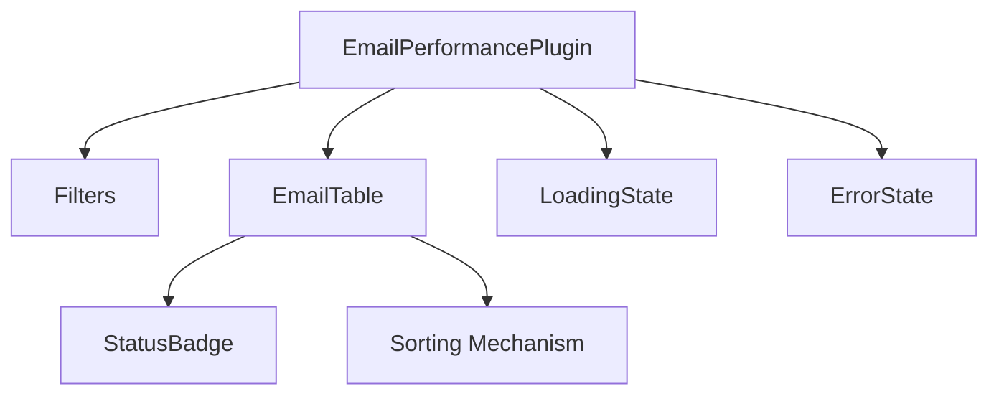

# Staffbase Email Performance Plugin

A custom plugin for viewing email performance metrics within the Staffbase platform.

## Prerequisites

- Node.js v16 or higher
- Bun (for package management and scripts)
- Staffbase account with appropriate permissions

## Setup

```bash
# Install dependencies
bun install

# Start development server
bun run start

# Build for production
bun run build

# Run tests
bun run test
```

## Environment Variables

| Variable | Description |
|----------|-------------|
| STAFFBASE_API_URL | Base URL for Staffbase API (optional, defaults to https://api.staffbase.com) |

## Field Availability Matrix

### Available Fields
| Field | API Column |
|-------|------------|
| `message_id` | Email ID |
| `send_datetime_utc` | Sent At |
| `unique_opens` | Unique Opens |
| `unique_clicks` | Unique Clicks |
| `total_clicks` | Total Clicks |
| `open_rate` | Open Percentage |
| `click_through_rate` | Click Percentage |

### Uncertain/Unavailable Fields
| Field | Notes |
|-------|-------|
| `channel` | Will have no analytics for Staffbase Email channel type |
| `subject_line` | Needed, likely retrievable |
| `preheader_text` | Needed, likely retrievable |
| `sender_name` | Needed, likely retrievable |
| `language` | Possibly retrievable |
| `audience_segment` | Partially retrievable |
| `campaign_id` | Partially retrievable |
| `campaign_name` | Partially retrievable |
| `emails_sent` | May need to be calculated |
| `emails_delivered` | Availability unsure |
| `eligible_population` | Availability unsure — definition unclear, verify via API |

## Known Limitations

1. The `channel` field is not applicable for Staffbase Email channel type
2. Some fields like `language`, `audience_segment`, etc., may require additional API endpoints to retrieve
3. `emails_delivered` and `eligible_population` fields are not confirmed to be available via the current API

## Component Architecture

