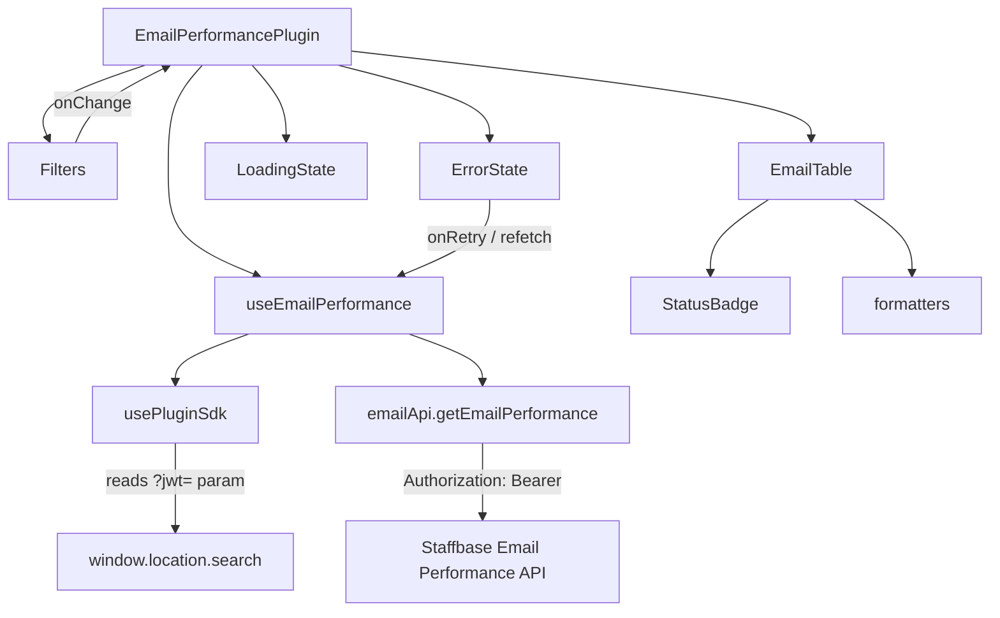

# Email Performance Plugin

A Staffbase Custom Plugin that replicates the Email Performance dashboard using the Staffbase Email Performance API. Renders inside the Staffbase platform as an embedded iframe.

---

## Dependencies

| Package | Version |
|---|---|
| `@staffbase/plugins-client-sdk` | 3.1.1 |
| `react` | 18.3.1 |
| `typescript` | 5.9.3 |
| `webpack` | 5.106.0 |
| `jest` | 29.7.0 |

### Package deviation from spec

The packages named in the original spec (`@staffbase/create-plugin`, `@staffbase/plugin-sdk-react`, `@staffbase/plugin-scripts`) do not exist on npm. See `CLAUDE.md` for full deviation notes and substitutions.

---

## Prerequisites

- **Node.js** ≥ 18
- **Bun** ≥ 1.0 (for `bun install` and script execution only — Bun is not the bundler)
- Staffbase account with access to the Email Performance API
- A valid `STAFFBASE_API_BASE_URL` (your Staffbase tenant API base URL)

---

## Setup

```bash
# Install dependencies
bun install

# Start development server (port 3000)
bun run start

# Run tests
bun run test

# Production build
bun run build
```

---

## Environment Variables

| Variable | Required | Description |
|---|---|---|
| `STAFFBASE_API_BASE_URL` | Yes | Base URL of your Staffbase tenant API (e.g. `https://tenant.staffbase.com`). Never hardcode — set in your deployment environment. |

In development, set it before running:

```bash
export STAFFBASE_API_BASE_URL=https://your-tenant.staffbase.com
bun run start
```

---

## Auth token

The Staffbase platform appends a signed JWT to the plugin iframe URL as `?jwt=<token>`. The `usePluginSdk` hook (`src/hooks/usePluginSdk.ts`) reads it from `window.location.search` and makes it available to the data-fetching layer. It is attached as `Authorization: Bearer <token>` on every API request.

The JWT should be verified server-side before being trusted for privileged operations.

---

## Field Availability Matrix

### Available — renders correctly

| Field | API Column | Notes |
|---|---|---|
| `message_id` | Email ID | Used as React key |
| `send_datetime_utc` | Sent At | Formatted via `formatDate()` |
| `unique_opens` | Unique Opens | Formatted via `formatCount()` |
| `unique_clicks` | Unique Clicks | Formatted via `formatCount()` |
| `total_clicks` | Total Clicks | Formatted via `formatCount()` |
| `open_rate` | Open Percentage | Formatted via `formatPercent()`, also drives `StatusBadge` |
| `click_through_rate` | Click Percentage | Formatted via `formatPercent()` |

### Uncertain / Unavailable — renders `—` when undefined

| Field | Notes |
|---|---|
| `subject_line` | Likely retrievable; renders `—` until confirmed |
| `sender_name` | Likely retrievable; renders `—` until confirmed |
| `preheader_text` | Likely retrievable; not displayed in table (available on record) |
| `language` | Possibly retrievable; renders `—` until confirmed |
| `channel` | No analytics available for Staffbase Email channel type |
| `audience_segment` | Partially retrievable |
| `campaign_id` | Partially retrievable |
| `campaign_name` | Partially retrievable |
| `emails_sent` | May need to be calculated |
| `emails_delivered` | Availability unclear |
| `eligible_population` | Definition and availability unclear |

All undefined/missing fields render as `—` (em dash). No blank cells, no "N/A", no "undefined".

---

## Known Limitations

1. **Auth token source**: Reads JWT from `?jwt=` URL query parameter. If the Staffbase platform delivers the token via a different mechanism (PostMessage, cookie, header), update `src/hooks/usePluginSdk.ts`.
2. **Base URL configuration**: `STAFFBASE_API_BASE_URL` must be set at runtime. The webpack `DefinePlugin` is not yet configured — the env var is read at runtime via `process.env`.
3. **No pagination**: The table renders all records returned by the API. If the API returns large result sets, add pagination.
4. **Client-side sort only**: Sorting does not trigger a refetch. Sorting is purely visual over the current result set.
5. **Auth errors are not retryable**: Auth (401/403) errors hide the retry button because retrying with the same expired token will always fail. The user must reload the plugin with a fresh JWT.
6. **Non-existent spec packages**: `@staffbase/create-plugin`, `@staffbase/plugin-sdk-react`, and `@staffbase/plugin-scripts` referenced in the original spec do not exist on npm. See `CLAUDE.md` for full substitution details.

---

## Component Architecture



### Component responsibilities

| Component | Responsibility |
|---|---|
| `EmailPerformancePlugin` | Root composition — no business logic |
| `Filters` | Time period selector; propagates param changes up |
| `EmailTable` | Renders records; client-side sort state |
| `StatusBadge` | Visual open-rate tier indicator (low/medium/high) |
| `LoadingState` | Skeleton table shown while fetching |
| `ErrorState` | Auth vs general error display with retry |
| `useEmailPerformance` | Orchestrates token + API call + error typing |
| `usePluginSdk` | Extracts JWT from platform iframe URL |
| `emailApi` | `fetch`-based API client with typed error handling |
| `formatters` | Pure functions: date, percent, count — all handle `undefined` |
